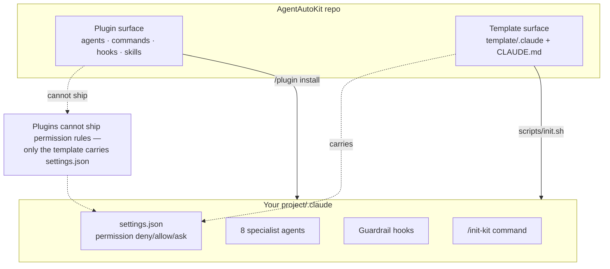
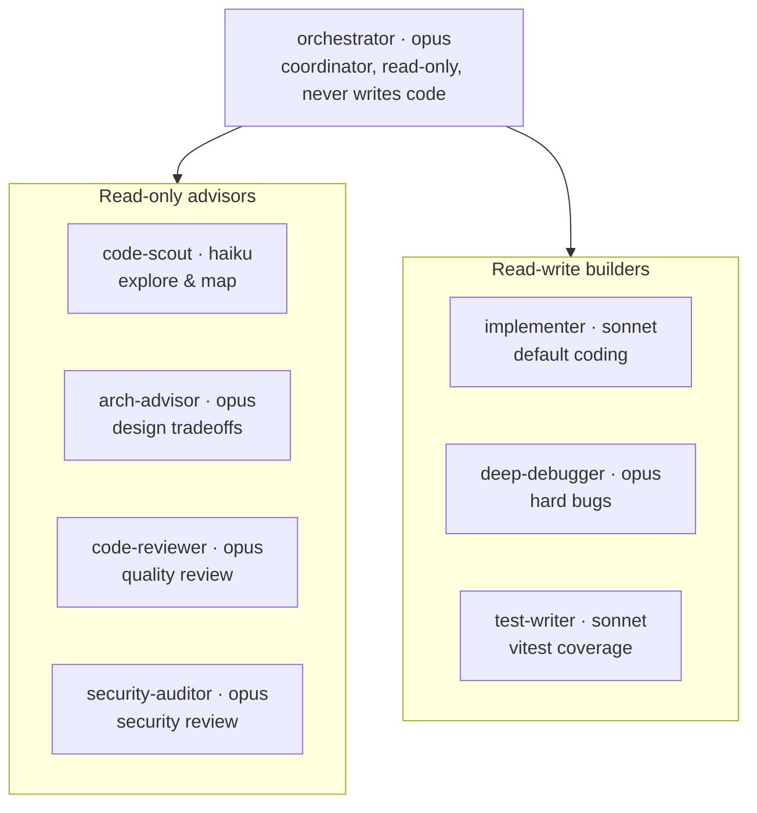
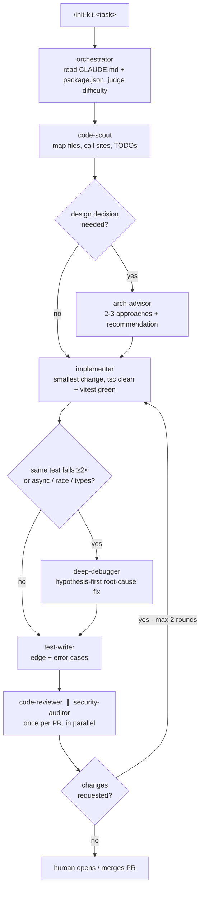
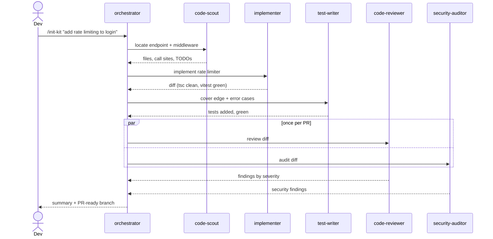
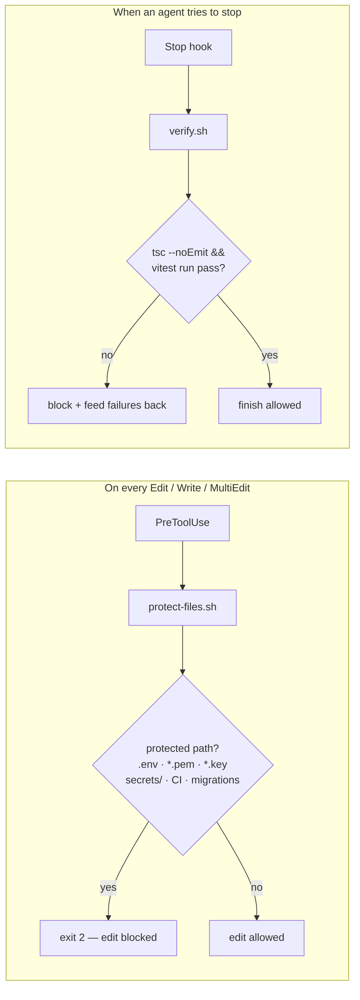
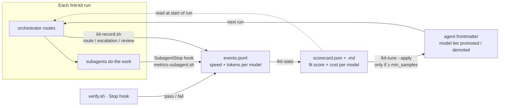

# AgentAutoKit

Reusable multi-agent workflow kit for **npm + TypeScript + Vitest + Vercel** projects, for use with Claude Code. Ships as **both** a repo template and a Claude Code plugin.

The idea: instead of one general assistant doing everything, AgentAutoKit gives you a small **team of specialist agents** — each on the right model tier, each with the narrowest tools it needs — coordinated by an orchestrator and fenced in by guardrail hooks so nothing risky (secrets, deploys, un-tested code) slips through.

---

## Table of contents

- [Product at a glance](#product-at-a-glance)
- [How it is delivered](#how-it-is-delivered)
- [The agent team](#the-agent-team)
- [Deep dive: what each agent does](#deep-dive-what-each-agent-does)
- [The workflow, step by step](#the-workflow-step-by-step)
- [A run, end to end](#a-run-end-to-end)
- [Guardrails](#guardrails)
- [Self-tuning: measure → score → re-allocate](#self-tuning-measure--score--re-allocate)
- [Install & use](#install--use)
- [Customizing](#customizing)
- [License](#license)

---

## Product at a glance

AgentAutoKit is a drop-in `.claude/` configuration. Once installed into a project, typing `/init-kit <task>` starts a coordinated pipeline: explore → (design) → implement → (debug) → test → review, with two hooks acting as a safety net on every edit and every attempt to finish.

Three moving parts:

| Part | What it is | Where it lives |
|------|------------|----------------|
| **Agents** | 8 specialists with scoped tools + model tiers | `agents/` (plugin) · `template/.claude/agents/` |
| **Guardrails** | Two shell hooks that block unsafe edits and un-verified finishes | `hooks/` · `template/.claude/hooks/` |
| **Telemetry & tuning** | Per-model speed/cost + fit scoring that feeds routing back into itself | `scripts/` + `SubagentStop` hook |
| **Commands** | `/init-kit` (entry), `/kit-stats` (scorecard), `/kit-tune` (re-allocate) | `commands/` · `template/.claude/commands/` |

---

## How it is delivered

The kit exists in two forms from the same repo. They differ in one important way: **plugins cannot ship permission rules** — Claude Code only reads `agent`/`subagentStatusLine` from a plugin's settings — so the permission `deny`/`allow`/`ask` lists live only in the template's `settings.json`.



**Rule of thumb:** use the **template** if you want the permission guardrails (recommended); use the **plugin** if you just want reusable agents/commands/hooks and will add the deny rules yourself.

---

## The agent team

Eight agents split into three lanes — one coordinator, four read-only advisors, three read-write builders. Model tier is chosen per role: `haiku` for cheap fan-out exploration, `sonnet` for routine building, `opus` for judgement-heavy work (design, hard bugs, review).



| Agent | Model | Writes code? | Tools | One-line job |
|-------|-------|:---:|-------|--------------|
| `orchestrator` | opus | no | `Read, Grep, Glob` + delegation | Judge difficulty, route work, re-plan on failure |
| `code-scout` | haiku | no | `Read, Grep, Glob` | Locate files, call sites, dead code, TODOs |
| `arch-advisor` | opus | no | `Read, Grep, Glob` | 2–3 approaches + a recommendation |
| `implementer` | sonnet | **yes** | `Edit, Write, npm/tsc/vitest, git status/diff` | Smallest change that solves the task |
| `deep-debugger` | opus | **yes** | `Edit, Write, npm/tsc/vitest, git status/diff` | Root-cause fix for async/race/type/state bugs |
| `test-writer` | sonnet | **yes** | `Edit, Write, vitest, git diff` | Vitest coverage for edge & error paths |
| `code-reviewer` | opus | no | `Read, Grep, Glob, git diff/log` | Severity-rated review of the diff |
| `security-auditor` | opus | no | `Read, Grep, Glob, git diff` | Secrets, injection, authz, path traversal |

---

## Deep dive: what each agent does

### `orchestrator` — the coordinator (opus, read-only)
The entry brain. It never edits code itself; its whole job is judgement and routing.

- **Inputs:** the task, plus a quick read of `CLAUDE.md` + `package.json` to load conventions and commands.
- **Decides:** how hard the task is, which specialist to call, and — critically — what to do when a branch fails (re-plan rather than stop).
- **Escalation rule it enforces:** send `implementer` → `deep-debugger` **only** when the same test fails ≥ 2× on one change, or the problem is async/race, complex generics, or subtle state.
- **Feedback loop:** if review comes back "changes requested", route findings back to `implementer`, capped at **2 rounds**; after that, stop and summarize the blocker for the human.
- **Hard limits:** never push/deploy/delete, never bypass the verify gate.

> Note on execution: the orchestration *playbook* is what the `/init-kit` command runs in the main session (which can delegate). `orchestrator.md` documents that playbook.

### `code-scout` — the explorer (haiku, read-only)
Cheap, fast, high fan-out. Runs first so the expensive agents don't burn tokens re-discovering the codebase.

- **Returns:** files that matter (path + one line each), key functions/types and where they live, and anything surprising (dead code, duplicate logic, TODOs).
- **Boundaries:** proposes no changes; refuses to read `.env*`/secrets and says so instead.

### `arch-advisor` — the designer (opus, read-only)
Pulled in only when a task needs a real design decision, so you pay for opus judgement only when it matters.

- **Returns:** 2–3 viable approaches with concrete tradeoffs, one clear recommendation tied to the codebase's existing patterns, and flagged risks (coupling, migration cost, performance, testability).
- **Style:** decision-oriented — always ends with a recommendation, not a menu.

### `implementer` — the default builder (sonnet)
The workhorse. Most tasks live and die here.

- **Method:** read first (or reuse code-scout's map) → make the **smallest** change that fully solves the task → keep `tsc --noEmit` clean and `vitest run` green → match existing style.
- **Self-limiting:** if it hits the same test failure twice, it stops and reports so the orchestrator can escalate — it does not thrash.
- **Boundaries:** won't touch protected files (the hook blocks it anyway), won't push/deploy/delete.

### `deep-debugger` — the specialist (opus)
Called for the bugs `implementer` can't crack: async/race conditions, complex generics, subtle state.

- **Method:** form an explicit root-cause hypothesis *before* touching code → confirm with targeted logging or a minimal failing test → fix the root cause, not the symptom → verify with tsc + vitest → **remove debug scaffolding** before finishing.
- **Output contract:** explains the root cause in one paragraph so the fix is understood, not just applied.

### `test-writer` — the coverage author (sonnet)
Ships alongside every change with new/changed logic.

- **Method:** read the code under test and the diff → write tests for intended behavior, edge cases, and error paths → colocated `*.test.ts` matching conventions → run `vitest run` and confirm green.
- **Integrity rule:** never edits source to make a test pass — if the code looks wrong, it reports rather than papering over it.

### `code-reviewer` — quality gate (opus, read-only, once per PR)
Reviews the accumulated `git diff`, not every edit.

- **Returns:** issues grouped **Critical / Warning / Suggestion**, each with file + line + what to change; says so plainly when the diff is clean.
- **Boundaries:** reports only — the orchestrator routes fixes back to `implementer`.

### `security-auditor` — security gate (opus, read-only, once per PR)
Runs **in parallel** with `code-reviewer` so the two gates don't serialize.

- **Checks:** committed/logged secrets, injection (SQL/command/XSS), unsafe deserialization, missing authz/authn and IDOR, unsafe user-input handling and path traversal, dependency risks introduced by the change.
- **Returns:** findings by severity with concrete remediation; reports only, never edits.

---

## The workflow, step by step



The two decision diamonds are where the kit earns its keep: **escalation** (route hard bugs to opus instead of letting sonnet thrash) and the **review loop** (bounded at 2 rounds so it can't spin forever).

---

## A run, end to end

A concrete trace of "add rate limiting to the login endpoint":



---

## Guardrails

Two hooks enforce the rules regardless of what any agent decides. They are the reason the kit is safe to run semi-autonomously.



- **`protect-files.sh`** (PreToolUse on `Edit|Write|MultiEdit`) — blocks writes to `.env*`, `*.pem`, `*.key`, `secrets/`, `.github/workflows/`, and `migrations/` (matched whether the path is absolute or root-relative). Exits `2`, and its stderr is fed back to the agent so it knows *why* it was blocked.
- **`verify.sh`** (Stop) — before an agent is allowed to finish, runs `tsc --noEmit` then `vitest run`. On failure it emits a `block` decision with the tail of the output, forcing a fix before completion. Skips gracefully when there is no `package.json`, and guards against infinite Stop-hook loops.

Complementing the hooks, the template's `settings.json` sets **permission** policy:

- `deny` — reading `.env`/`*.pem`/`*.key`/`secrets/`, plus `rm -rf`, `git push`, and destructive `vercel` verbs (`deploy`, `--prod`, `promote`, `rollback`, `remove`, `env rm`, `domains`).
- `allow` — safe read-only commands (`git status/diff/log`, `npm run lint/test/build`, `tsc`, `vitest`, `vercel env pull/list/logs`).
- `ask` — `git commit`, `gh pr create`, `gh pr merge` (humans confirm).

---

## Self-tuning: measure → score → re-allocate

The kit measures itself and feeds the numbers back into routing, so model allocation gets closer to your real workload over time instead of staying at hand-picked defaults.



### What is measured, and how honestly

Two halves, deliberately kept separate because they differ in how measurable they are:

| Signal | Source | Reliability |
|--------|--------|-------------|
| **Speed & token cost per model** | `SubagentStop` hook parses the session transcript (`isSidechain` turns → model, `usage`, timestamps) | Directly measured |
| **"Fit" per agent** | Pipeline **proxies** logged by the orchestrator: escalation to `deep-debugger`, review rounds, verify first-pass | Proxy — correlates with quality, not ground truth |

There is no automatic quality oracle, so "fit" is defined as objective pipeline outcomes. For v1: `fit_score = 1 − escalation_rate` (an agent that keeps needing escalation is under-powered for its tasks).

### The three commands / files

- **Telemetry** lands in `.claude/metrics/events.jsonl` (git-ignored). Written by the `SubagentStop` hook (speed/cost), `verify.sh` (pass/fail), and `kit-record.sh` (routing/escalation/review, called by the orchestrator).
- **`/kit-stats`** → aggregates events into `.claude/metrics/scorecard.{json,md}`: per-model p50/p95 duration + estimated cost, per-agent fit score, and pipeline health (verify first-pass rate, avg review rounds).
- **`/kit-tune`** → reads the scorecard and, **only past a sample threshold**, moves an agent along the ladder `haiku → sonnet → opus`. Dry-run by default; `--apply` edits the `model:` frontmatter line and logs the decision to `tuning-log.md`. The edit is a normal diff a human reviews before committing.

### Tuning thresholds

Configurable in `.claude/metrics/tuning.json` (defaults shown):

```json
{ "min_samples": 20, "promote_if_fit_below": 0.6, "enable_demote": false, "demote_if_fit_above": 0.97 }
```

An agent is **promoted** one tier when it has ≥ `min_samples` runs and its fit score falls below `promote_if_fit_below`. Demotion (to save cost on over-provisioned agents) is opt-in. Token prices for the cost estimate live in `.claude/metrics/pricing.json` — set your real per-model rates.

> **Honest limits:** the transcript format is internal and may change between Claude Code versions, so the parser is defensive and best-effort. Proxies correlate with quality but are not a substitute for it. Small samples are noisy — that is what `min_samples` guards against. Full auto-tune is scoped to a single reversible frontmatter edit, never anything destructive.

> Full metrics only ships with the **template** install (it carries `scripts/`). A plugin-only install still gets the `SubagentStop` speed/cost telemetry, but add the `scripts/` + commands to your project for the scorecard and auto-tune.

---

## Install & use

### A) As a repo template (recommended — carries permission rules)

```bash
git clone https://github.com/slenderman2511/AgentAutoKit
./AgentAutoKit/scripts/init.sh /path/to/your/project
```

This copies `.claude/` (agents, commands, hooks, **settings.json with permission deny rules**) and a root `CLAUDE.md` into your project.

### B) As a Claude Code plugin (reusable agents/commands/hooks)

```
/plugin marketplace add slenderman2511/AgentAutoKit
/plugin install agent-auto-kit@agent-auto-kit-marketplace
```

Local test without installing:

```bash
claude --plugin-dir ./AgentAutoKit
claude plugin validate ./AgentAutoKit --strict
```

> **Important:** a plugin cannot ship permission rules (Claude Code only reads `agent`/`subagentStatusLine` from a plugin's settings). If you install via the plugin, add this to your project's `.claude/settings.json` manually:

```json
{
  "permissions": {
    "deny": [
      "Read(./.env)", "Read(./.env.*)", "Read(./**/*.pem)", "Read(./**/*.key)", "Read(./**/secrets/**)",
      "Bash(rm -rf:*)", "Bash(git push:*)",
      "Bash(vercel deploy:*)", "Bash(vercel --prod:*)", "Bash(vercel promote:*)",
      "Bash(vercel rollback:*)", "Bash(vercel remove:*)", "Bash(vercel env rm:*)", "Bash(vercel domains:*)"
    ]
  }
}
```

### Then, in any installed project

```
/init-kit "add rate limiting to the login endpoint"
```

---

## Customizing

- Swap model aliases in agent frontmatter (`opus`/`sonnet`/`haiku`) or pin IDs (`claude-opus-4-8`, `claude-sonnet-5`, `claude-haiku-4-5-20251001`).
- Edit `hooks/protect-files.sh` to adjust protected paths.
- Tighten/loosen `template/.claude/settings.json` permissions per project.

## License
MIT
