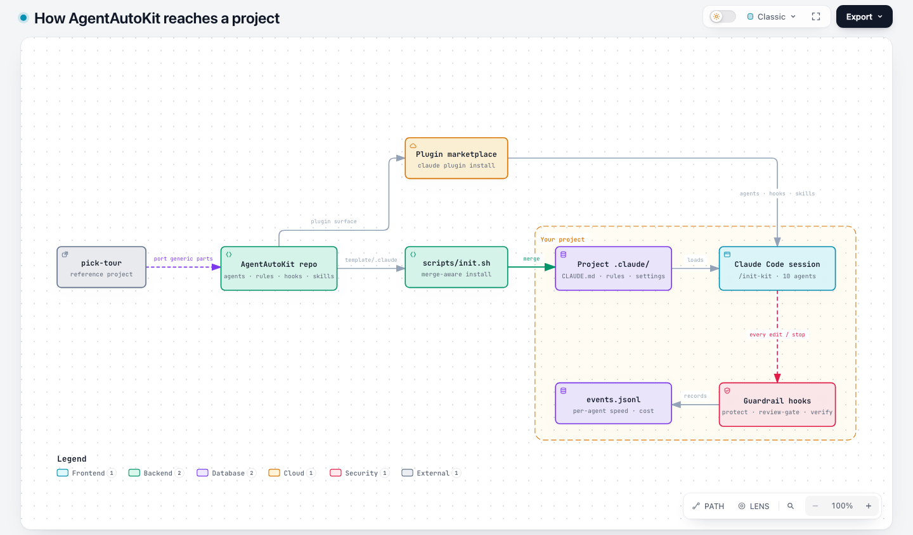
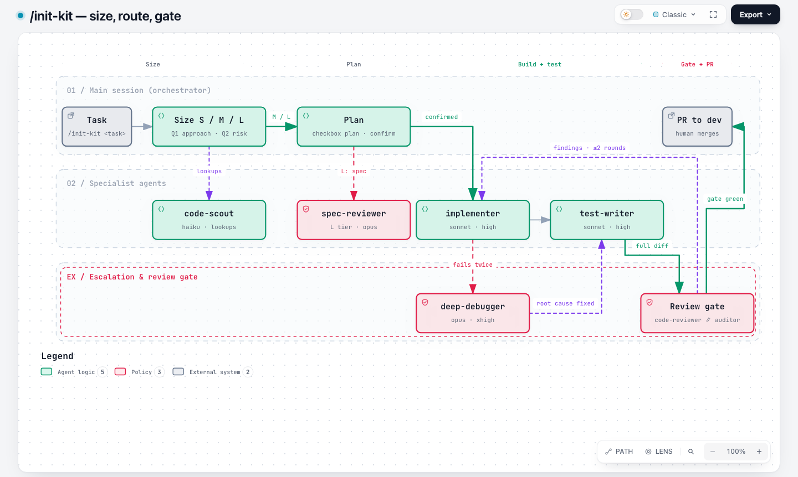
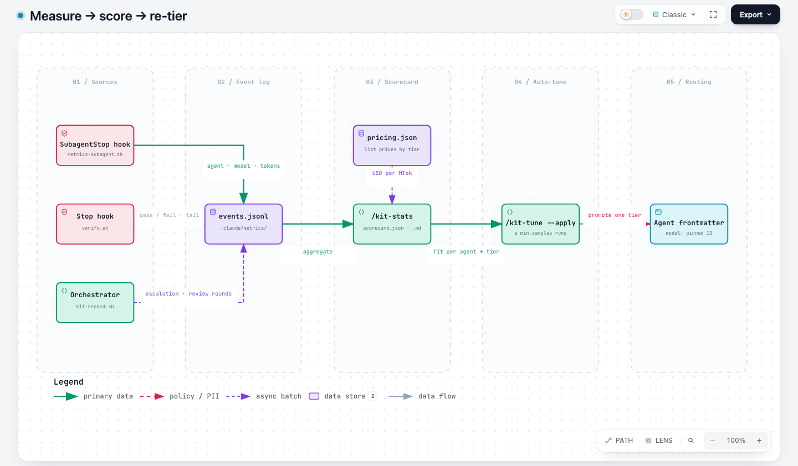
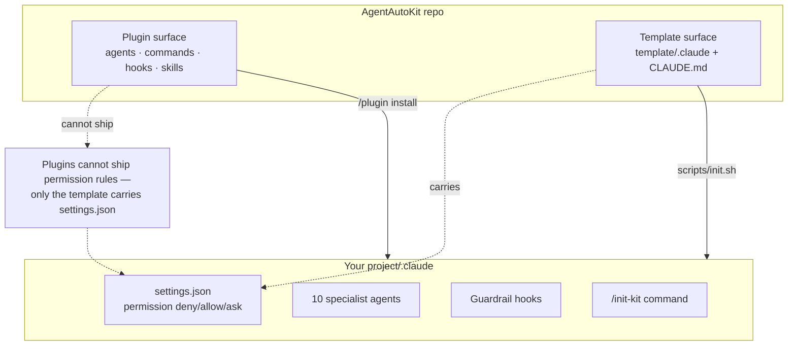
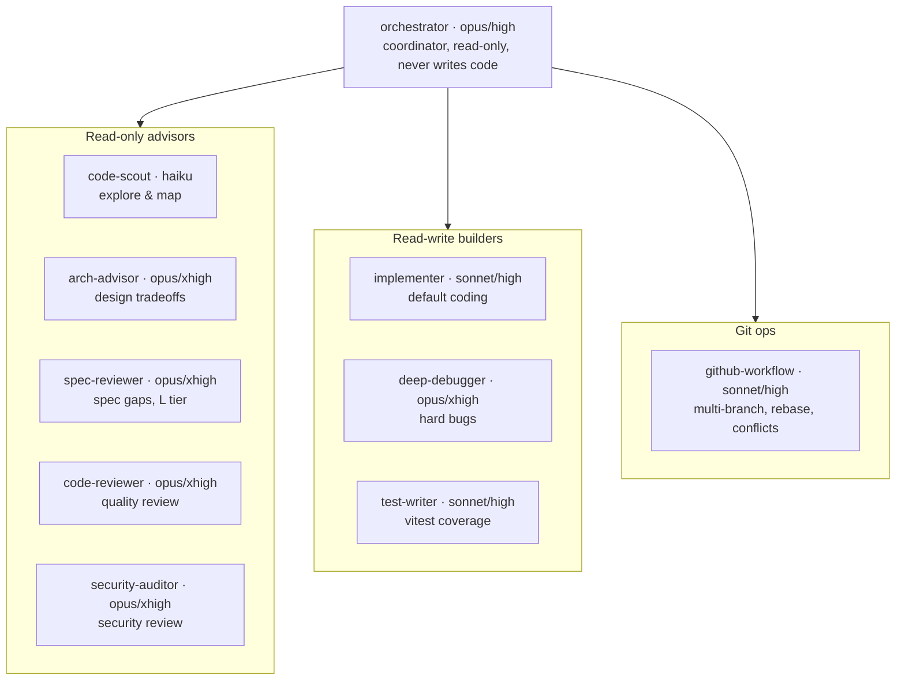
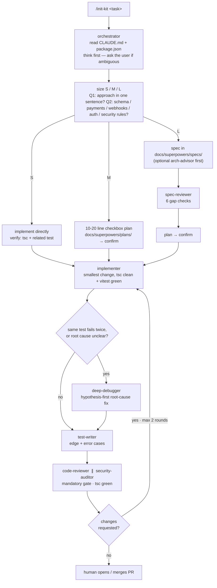
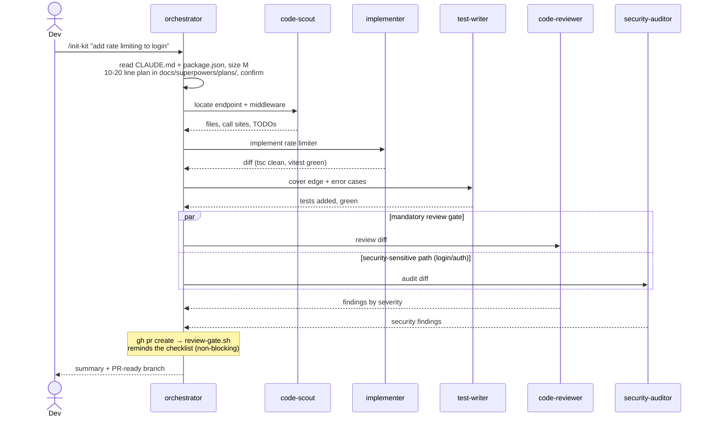
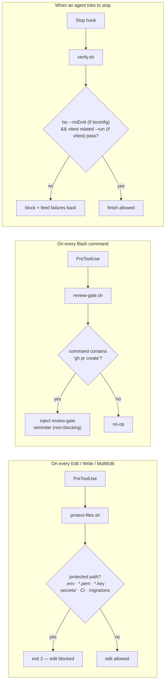
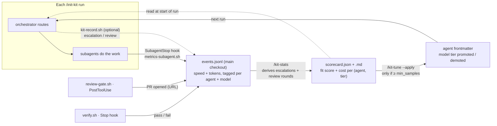

# AgentAutoKit

Reusable multi-agent workflow kit for **npm + TypeScript + Vitest + Vercel** projects, for use with Claude Code. Ships as **both** a repo template and a Claude Code plugin.

The idea: instead of one general assistant doing everything, AgentAutoKit gives you a small **team of specialist agents** — each on the right model tier, each with the narrowest tools it needs — coordinated by an orchestrator and fenced in by guardrail hooks so nothing risky (secrets, deploys, un-tested code) slips through.

The workflow itself is ported (and generalized) from the kit's reference project, **pick-tour (SportTora)** — a production multi-tenant tournament platform that runs this exact process end-to-end. Process improvements are proven there first, then folded back into the kit by hand (see [Upgrading to 2.0](#upgrading-to-20) and the Forked-agents warning near the end).

---

## Table of contents

- [Product at a glance](#product-at-a-glance)
- [The kit in three diagrams](#the-kit-in-three-diagrams)
- [Install & use](#install--use)
- [Full inventory: every tool & feature](#full-inventory-every-tool--feature)
- [How it is delivered](#how-it-is-delivered)
- [The agent team](#the-agent-team)
- [Deep dive: what each agent does](#deep-dive-what-each-agent-does)
- [The workflow, step by step](#the-workflow-step-by-step)
- [A run, end to end](#a-run-end-to-end)
- [Guardrails](#guardrails)
- [Bundled skills & companion plugins](#bundled-skills--companion-plugins)
- [Self-tuning: measure → score → re-allocate](#self-tuning-measure--score--re-allocate)
- [Live status line — see which agents are running](#live-status-line--see-which-agents-are-running)
- [Customizing](#customizing)
- [License](#license)

---

## Product at a glance

AgentAutoKit is a drop-in `.claude/` configuration. Once installed into a project, typing `/init-kit <task>` starts a coordinated pipeline: think → size (S/M/L) → (spec + `spec-reviewer`, L only) → implement → (debug) → test → review, with four hooks acting as a safety net on every edit, every `gh pr create`, and every attempt to finish. The playbook itself — task sizing, worktree-first discipline, model routing — lives in `.claude/rules/*.md`, auto-loaded by Claude Code.

The moving parts:

| Part | What it is | Where it lives |
|------|------------|----------------|
| **Agents** | 10 specialists with scoped tools, model tier + effort | `agents/` (plugin) · `template/.claude/agents/` |
| **Playbook** | Working discipline, Task Sizing S/M/L, model routing, orchestrator rules | `.claude/rules/workflow.md` (+ `epic-flow.md`, `general.md`) — template only, auto-loaded |
| **Guardrails** | 4 shell hooks: block unsafe edits, remind the review gate before a PR, gate un-verified finishes | `hooks/` · `template/.claude/hooks/` |
| **Telemetry & tuning** | Per-model speed/cost + fit scoring that feeds routing back into itself | `scripts/` + `SubagentStop` hook |
| **Status line** | Live view of which agents are running (agent-panel rows + bottom bar) | `scripts/*statusline.sh` + `subagentStatusLine`/`statusLine` |
| **Commands** | `/init-kit` (entry), `/kit-stats` (scorecard), `/kit-tune` (re-allocate) | `commands/` · `template/.claude/commands/` |
| **Skills** | 30 auto-loaded skills: workflow skills from the reference project, framework best practices, domain workflows | `skills/` · `template/.claude/skills/` |
| **Companion plugins** | 10 plugins declared for the whole team via `enabledPlugins` | `template/.claude/settings.json` |
| **Installer** | Idempotent merge-aware `init.sh` — installs, upgrades, never clobbers | `scripts/init.sh` |

---

## The kit in three diagrams

Drawn with the bundled `archify` skill. Each image follows your GitHub light/dark theme; the interactive versions (pan, zoom, search, light/dark, PNG/SVG export) are the `.html` files in [`docs/diagrams/`](docs/diagrams/) — download one and open it in a browser. The `.json` next to each is its source spec: edit it and re-render with `node skills/archify/bin/archify.mjs deliver <type> <spec.json> <out.html> --quality showcase`.

**1 · How the kit reaches a project** — the reference project feeds the kit; the kit installs either as a template (with permissions and rules) or as a plugin; inside the project, hooks guard every edit and record telemetry.

<picture>
  <source media="(prefers-color-scheme: dark)" srcset="docs/diagrams/delivery.dark.png">
  
</picture>

**2 · `/init-kit`: size, route, gate** — every task is sized S/M/L first; M and L get a plan (L also a spec reviewed by `spec-reviewer`); `implementer` escalates to `deep-debugger` after two failures; nothing reaches a PR without the review gate.

<picture>
  <source media="(prefers-color-scheme: dark)" srcset="docs/diagrams/workflow.dark.png">
  
</picture>

**3 · Measure → score → re-tier** — hooks write one `events.jsonl` in the main checkout; `/kit-stats` turns it into a scorecard priced by tier, deriving escalations and review rounds from run order; `/kit-tune --apply` promotes an under-fit agent one tier in its frontmatter, as a diff a human reviews.

<picture>
  <source media="(prefers-color-scheme: dark)" srcset="docs/diagrams/telemetry.dark.png">
  
</picture>

## Install & use

Pick ONE of the two surfaces per project — never both, or agents, commands and skills load twice under the same names.

### A) As a repo template (recommended — carries permission rules + companion plugins)

```bash
git clone https://github.com/slenderman2511/AgentAutoKit
./AgentAutoKit/scripts/init.sh /path/to/your/project            # install or upgrade
./AgentAutoKit/scripts/init.sh /path/to/your/project --dry-run  # preview what would change
```

This merges `.claude/` (agents, commands, hooks, skills, **settings.json with permission deny rules and the companion-plugin roster**) and a root `CLAUDE.md` into your project.

**Upgrading** = `git pull` in the kit clone, then re-run the same `init.sh` command. It is idempotent and merge-safe:

- Missing files installed; identical files skipped; drifted files **synced to the kit's version** and listed for `git diff` review.
- Files your project added itself (extra skills, agents, commands) are never touched — no duplicates, no conflicts.
- `settings.json` is **deep-merged, never overwritten**: your permission rules, hooks, `enabledPlugins` and marketplaces are kept; the kit only fills gaps. To permanently opt out of a kit-declared plugin, set it to `false` instead of deleting the key (a deleted key gets re-filled on the next upgrade).
- An existing root `CLAUDE.md` is never overwritten; the installed kit version is stamped in `.claude/.agentautokit-version`.

### Upgrading to 2.0

- `init.sh`'s deep merge **unions** permission lists rather than replacing them, so an existing project keeps its old blanket `Bash(git push:*)` deny even though the 2.0 template narrows this to denying only `dev`/`main` pushes and force-pushes (everything else moves to `ask`). Remove the old blanket deny by hand from `.claude/settings.json` if `github-workflow` should be able to push feature branches.
- An existing root `CLAUDE.md` is **never overwritten**. The new playbook (task sizing, worktree-first, model routing) arrives entirely through `.claude/rules/workflow.md` (+ `epic-flow.md`, `general.md`), which IS synced on upgrade like any other kit file — but the *project-facts* sections that now live in the 2.0 template's `CLAUDE.md` (integration branch, security-sensitive paths, project-specific gates) won't appear in an older project's `CLAUDE.md` on their own. Copy them over by hand from [`template/.claude/CLAUDE.md`](template/.claude/CLAUDE.md).
- `init.sh` now also adds `.claude/worktrees/` to the project's `.gitignore` if it isn't already there.

### B) As a Claude Code plugin (agents/commands/hooks/skills, no permission rules)

**Step 1 — register the marketplace (once per machine).** This step is required: `plugin install` and `marketplace update` only know marketplaces you have added, so skipping it fails with `Marketplace 'agent-auto-kit-marketplace' not found`.

```bash
claude plugin marketplace add slenderman2511/AgentAutoKit
```

(or `/plugin marketplace add slenderman2511/AgentAutoKit` inside a session). If this repo is private for you, your machine needs git credentials that can read it — run `gh auth login` first.

**Step 2 — install:**

```bash
claude plugin install agent-auto-kit@agent-auto-kit-marketplace
```

**Upgrading** (Claude Code caches plugins and only re-pulls when `version` in `plugin.json` changes):

```bash
claude plugin marketplace update agent-auto-kit-marketplace   # refresh the marketplace clone
claude plugin update agent-auto-kit                           # pull the new plugin version
```

Check what you have with `claude plugin marketplace list` and `claude plugin list`.

Local test without installing:

```bash
claude --plugin-dir ./AgentAutoKit
claude plugin validate ./AgentAutoKit --strict
```

> **Important:** a plugin cannot ship permission rules or `enabledPlugins` (Claude Code only reads `agent`/`subagentStatusLine` from a plugin's settings). If you install via the plugin, add the deny rules to your project's `.claude/settings.json` yourself — copy them from [`template/.claude/settings.json`](template/.claude/settings.json).

### Then, in any installed project

```
/init-kit "add rate limiting to the login endpoint"
```

---

## Full inventory: every tool & feature

### The 10 agents

Every agent reads `CLAUDE.md` + `.claude/rules/` for project conventions and returns a concise, size-capped summary (`path:line`, no long dumps) instead of a full transcript — see [Deep dive](#deep-dive-what-each-agent-does) for each agent's exact output contract.

| Agent | Model | Effort | Access | Job |
|-------|-------|:---:|--------|-----|
| `orchestrator` | claude-opus-5-5 | high | read-only + Agent | Judges difficulty, routes to specialists, re-plans on failure. Never writes code. |
| `code-scout` | haiku | – | read-only | Cheap fan-out exploration: locate code, map structure before anyone edits. |
| `arch-advisor` | claude-opus-5-5 | xhigh | read-only | Design/architecture decisions before implementation. |
| `spec-reviewer` | claude-opus-5-5 | xhigh | read-only | Reviews an L-tier spec in `docs/superpowers/specs/` before the plan: 6 checks — out-of-scope reasons, verifiable conditions, perf/query constraints locked, types exist, data scoping & naming, implementable without questions. |
| `implementer` | claude-sonnet-5-5 | high | read-write | Routine feature/bugfix implementation. |
| `deep-debugger` | claude-opus-5-5 | xhigh | read-write | Escalation target: tests failing ≥2×, async/race conditions, subtle state bugs. |
| `test-writer` | claude-sonnet-5-5 | high | read-write | Coverage for new/changed logic. |
| `code-reviewer` | claude-opus-5-5 | xhigh | read-only | Pre-PR review (runs in parallel with security-auditor, once per PR). |
| `security-auditor` | claude-opus-5-5 | xhigh | read-only | Pre-PR security pass on auth/API/rules surfaces. |
| `github-workflow` | claude-sonnet-5-5 | high | git ops | Complex git ops only — multi-branch, rebase, conflicts. PRs always base the integration branch; never merges, never pushes protected branches, never force-pushes. |

### The 3 commands

| Command | What it does |
|---------|--------------|
| `/init-kit <task>` | Entry point — kicks off the coordinated think → size (S/M/L) → implement → debug → test → review pipeline. |
| `/kit-stats` | Aggregates telemetry into a scorecard: per-model p50/p95 duration + cost (incl. cache tokens), per-(agent, tier) fit score with off-pin runs flagged, pipeline health (verify pass rate, review rounds per PR, PRs opened without review). |
| `/kit-tune [--apply]` | Proposes (dry-run) or applies model-tier promotions/demotions from measured fit, guarded by `min_samples`. |

### The guardrail hooks (4)

| Hook | Event | Enforcement |
|------|-------|-------------|
| `protect-files.sh` | `PreToolUse` (Edit/Write/MultiEdit) | Blocks edits to `.env*`, secrets, keys, CI workflows, migrations. |
| `review-gate.sh` | `PreToolUse` + `PostToolUse` (Bash) | Non-blocking: before `gh pr create`, injects the mandatory review-gate checklist as additional context (ported from pick-tour); after it, logs a `pr` event when the output carries the new PR's URL, so `/kit-stats` can count review rounds per PR. |
| `verify.sh` | `Stop` | Runs `tsc --noEmit` only if `tsconfig.json` exists, and Vitest only if `package.json` lists it — as `vitest related --run` on changed + untracked source files (the full suite is CI's job). A docs-only change skips cleanly. Blocks finishing on failure; a failed run records the failing step + last 20 output lines. 300s timeout. |
| `metrics-subagent.sh` | `SubagentStop` | Measures every subagent run (tokens incl. cache, duration per sidechain), tagged with its agent name from `agent_type`, into the main checkout's `events.jsonl`. Never blocks. |

Hooks are the kit's enforcement layer — CLAUDE.md only reminds; hooks make rules stick. The bundled **hookify** plugin authors new ones conversationally.

### Telemetry & self-tuning (details [below](#self-tuning-measure--score--re-allocate))

- Two-sided measurement: hard numbers from transcripts (speed/tokens/cost, tagged per agent + model tier) + pipeline proxies derived from the order of runs (escalation = `implementer` followed by `deep-debugger`; review rounds = `code-reviewer` runs before each opened PR; verify pass rate comes from the `Stop` hook).
- One event log per repo: every worktree writes to the main checkout's `.claude/metrics/`, so removing a worktree after its PR merges keeps its data.
- Fit scored per (agent, tier) so promotions are evaluated on fresh evidence; demotion is opt-in and requires a real escalation signal.
- Auto-tune edits one reversible `model:` frontmatter line, dry-run by default, human-reviewed diff.

### The 30 skills (details [below](#bundled-skills--companion-plugins))

- **Workflow (9):** `worktree-dev` · `git-workflow` · `context-checkpoint` · `ui-prototype` · `ui-verify` · `github-issue-flow` · `add-bug-to-github` · `fix-from-github` · `conventions`
- **Best practices (18):** `frontend-design` · `hallmark` · `responsive-design` · `accessibility` · `seo` · `react-best-practices` · `composition-patterns` · `typescript-advanced-types` · `tailwind-css-patterns` · `nodejs-best-practices` · `nodejs-backend-patterns` · `playwright-best-practices` · `firebase-best-practices` · `payment-integration` · `stripe-best-practices` · `upgrade-stripe` · `i18n-best-practices` · `archify`
- **Domain (3, tournament apps on Firebase):** `roster-import` · `firestore-config-edit` · `e2e-flow`

All auto-loaded by Claude when the task matches their triggers.

### The 10 companion plugins

`firebase` · `playground` · `playwright` · `github` · `code-review` · `context7` (official marketplace) · `hookify` (claude-code) · `superpowers` (obra) · `claude-mem` (cross-session memory) · `ponytail` (DietrichGebert — keeps diffs small) — declared once in the template's `settings.json`, offered to every teammate who trusts the folder.

### Template settings (`template/.claude/settings.json`, template only)

- **Main session:** pinned to `"model": "claude-opus-5-5"` — the same model on every machine; override per session with `claude --model sonnet`. `env.DISABLE_OMC = "1"` opts out of stacking a second orchestration layer on top of the kit's own, matching pick-tour, the reference project.
- **Permissions:** `deny` on secret reads (`.env*`, `*.pem`, `*.key`), destructive shell (`rm -rf`), pushes to `dev`/`main` (incl. `-u` variants) and force-pushes, and all deploy commands; `ask` on commits, any other `git push`, and PR creation/merge; `allow` on the safe everyday loop (lint/test/build/`tsc`/`vitest`/`eslint`, kit scripts, read-only git/vercel).

### Live status line

Agent-panel rows per running subagent + a bottom-bar rollup, driven by `statusline.sh`/`subagent-statusline.sh`.

### Merge-aware installer

`init.sh` installs missing files, skips identical ones, syncs drifted ones (listed for `git diff` review), deep-merges `settings.json` (project values win; permission lists unioned; already-enabled plugins never re-added), never touches project-added files, stamps `.claude/.agentautokit-version`, supports `--dry-run`.

---

## How it is delivered

The kit exists in two forms from the same repo. They differ in one important way: **plugins cannot ship permission rules** — Claude Code only reads `agent`/`subagentStatusLine` from a plugin's settings — so the permission `deny`/`allow`/`ask` lists live only in the template's `settings.json`.


```mermaid
flowchart TB
  subgraph KIT["AgentAutoKit repo"]
    direction LR
    P["Plugin surface<br/>agents · commands · hooks · skills"]
    T["Template surface<br/>template/.claude + CLAUDE.md"]
  end
  P -->|"/plugin install"| PROJ
  T -->|"scripts/init.sh"| PROJ
  subgraph PROJ["Your project/.claude"]
    CMD["/init-kit command"]
    AG["10 specialist agents"]
    HK["Guardrail hooks"]
    ST["settings.json<br/>permission deny/allow/ask"]
  end
  note["Plugins cannot ship permission rules —<br/>only the template carries settings.json"]
  T -.->|"carries"| ST
  P -.->|"cannot ship"| note
  note -.-> ST
```

**Rule of thumb:** use the **template** if you want the permission guardrails (recommended); use the **plugin** if you just want reusable agents/commands/hooks and will add the deny rules yourself.

### Where the playbook lives

Claude Code auto-loads every `.claude/rules/*.md` file into context, so the kit's playbook ships as data the agents read, not prose duplicated across files:

- **`workflow.md`** — working discipline (think before coding, YAGNI, surgical changes), worktree-first, Task Sizing S/M/L, the model-routing table, orchestrator rules, and the main-session model policy. `/init-kit` and `orchestrator.md` both summarize this file.
- **`epic-flow.md`** — an optional wrapper above S/M/L for a multi-feature epic where the data model or UX isn't settled yet (lock the data → optional thin UX prototype → slice production into S/M tasks → one aspect sweep). A single task skips it entirely.
- **`general.md`** — code style and the mandatory Git workflow (protected branches, PR-only, forbidden commands).

`init.sh` re-syncs these three files on upgrade, same as agents/hooks/commands. The root `CLAUDE.md` template now holds only **project facts** — commands, the integration branch, security-sensitive paths, project-specific gates, project rules — so it stays short and rarely drifts from the rules files.

Also new: **`.claude/workflows/review-branch.js`** (template only) — an opt-in, multi-dimension review of the current branch's diff against a base (default `origin/dev`): one reviewer per dimension (correctness, data isolation & authz, payments & secrets, UI states, performance), each finding then adversarially re-verified before it's reported. Complements, and does not replace, the mandatory `code-reviewer` + `security-auditor` gate.

---

## The agent team

Ten agents split into four lanes — one coordinator, five read-only advisors, three read-write builders, one git-ops specialist. Model tier is chosen per role: `haiku` for cheap fan-out exploration, `sonnet` for routine building and git ops, `opus` for judgement-heavy work (design, spec review, hard bugs, code/security review).

The `sonnet` and `opus` tiers are **pinned to explicit model IDs** in agent frontmatter — `claude-sonnet-5-5` (Sonnet 5.5) and `claude-opus-5-5` (Opus 5.5) — so a Claude Code alias update never silently changes which model a role runs on. `code-scout` keeps the `haiku` alias (Haiku 4.5, which has no `effort` setting). Every other agent also pins an explicit `effort` (`high` or `xhigh`) in frontmatter, tuned per role. Tier names (`haiku`/`sonnet`/`opus`) in the tables below refer to these models.


```mermaid
flowchart TB
  ORC["orchestrator · opus/high<br/>coordinator, read-only, never writes code"]
  subgraph RO["Read-only advisors"]
    direction LR
    SC["code-scout · haiku<br/>explore & map"]
    AA["arch-advisor · opus/xhigh<br/>design tradeoffs"]
    SR["spec-reviewer · opus/xhigh<br/>spec gaps, L tier"]
    CR["code-reviewer · opus/xhigh<br/>quality review"]
    SA["security-auditor · opus/xhigh<br/>security review"]
  end
  subgraph RW["Read-write builders"]
    direction LR
    IM["implementer · sonnet/high<br/>default coding"]
    DD["deep-debugger · opus/xhigh<br/>hard bugs"]
    TW["test-writer · sonnet/high<br/>vitest coverage"]
  end
  subgraph GO["Git ops"]
    GW["github-workflow · sonnet/high<br/>multi-branch, rebase, conflicts"]
  end
  ORC --> RO
  ORC --> RW
  ORC --> GO
```

| Agent | Model | Effort | Writes code? | Tools | One-line job |
|-------|-------|:---:|:---:|-------|--------------|
| `orchestrator` | opus | high | no | `Read, Grep, Glob` + delegation | Judge difficulty, route work, re-plan on failure |
| `code-scout` | haiku | – | no | `Read, Grep, Glob` | Locate files, call sites, dead code, TODOs |
| `arch-advisor` | opus | xhigh | no | `Read, Grep, Glob` | 2–3 approaches + a recommendation |
| `spec-reviewer` | opus | xhigh | no | `Read, Grep, Glob` | Gap-check an L-tier spec before the plan (6 checks) |
| `implementer` | sonnet | high | **yes** | `Edit, Write, npm/tsc/vitest, git status/diff` | Smallest change that solves the task |
| `deep-debugger` | opus | xhigh | **yes** | `Edit, Write, npm/tsc/vitest, git status/diff` | Root-cause fix for async/race/type/state bugs |
| `test-writer` | sonnet | high | **yes** | `Edit, Write, vitest, git diff` | Vitest coverage for edge & error paths |
| `code-reviewer` | opus | xhigh | no | `Read, Grep, Glob, git diff/log` | Severity-rated review of the diff |
| `security-auditor` | opus | xhigh | no | `Read, Grep, Glob, git diff` | Secrets, injection, authz, path traversal |
| `github-workflow` | sonnet | high | no | `Read, Grep, Glob, git status/diff/log/fetch/switch/checkout/add/commit/rebase/push, gh pr create/view/list, tsc` | Branch, commit, rebase, PR — complex git ops only |

---

## Deep dive: what each agent does

### `orchestrator` — the coordinator (opus, read-only)
The entry brain. It never edits code itself; its whole job is judgement and routing.

- **Inputs:** the task, plus a quick read of `CLAUDE.md` + `package.json` to load conventions and commands.
- **Thinks before coding:** states its assumptions; stops and asks the user with `AskUserQuestion` when the request is ambiguous instead of guessing.
- **Sizes the task S/M/L first:** Q1 — approach statable in one sentence? Q2 — does it touch schema, payments, webhooks, auth, or a security rule? S implements directly; M gets a 10–20 line checkbox plan; L gets a spec reviewed by `spec-reviewer` before the plan is written. Ambiguous rounds UP.
- **Decides:** which specialist to call, and — critically — what to do when a branch fails (re-plan rather than stop).
- **Escalation rule it enforces:** send `implementer` → `deep-debugger` **only** when the same test fails ≥ 2× on one change, or the problem is async/race, complex generics, or subtle state.
- **Feedback loop:** if review comes back "changes requested", route findings back to `implementer`, capped at **2 rounds**; after that, stop and summarize the blocker for the human.
- **Complex git ops** (multi-branch, rebase, conflicts) route to `github-workflow`; a single commit + PR is done directly by the main session.
- **Hard limits:** never push/deploy/delete, never bypass the verify gate.

> Note on execution: the orchestration *playbook* is what the `/init-kit` command runs in the main session (which can delegate). `orchestrator.md` documents that playbook.

### `code-scout` — the explorer (haiku, read-only)
Cheap, fast, high fan-out. Runs first so the expensive agents don't burn tokens re-discovering the codebase.

- **Returns:** files that matter (path + one line each), key functions/types and where they live, and anything surprising (dead code, duplicate logic, TODOs).
- **Boundaries:** proposes no changes; refuses to read `.env*`/secrets and says so instead.

### `arch-advisor` — the designer (opus, read-only)
Pulled in only when a task needs a real design decision, so you pay for opus judgement only when it matters.

- **Returns:** 2–3 viable approaches with concrete tradeoffs, one clear recommendation tied to the codebase's existing patterns, and flagged risks (coupling, migration cost, performance, testability).
- **Style:** decision-oriented — always ends with a recommendation, not a menu.

### `spec-reviewer` — the spec gate (opus, read-only, L tier only)
Reviews an L-tier spec in `docs/superpowers/specs/` right before the plan is written — the cheapest point to catch a gap, before any code exists.

- **Checks, in order:** an `Explicitly out of scope` section where every bullet carries a reason; every condition written as a verifiable expression, not an adjective; performance/query constraints locked at spec level; every type mentioned actually exists in the repo (verified by grep, `file:line`); data scoping & naming checked against `CLAUDE.md`/`.claude/rules/`; implementable without asking a further question.
- **Reporting style:** reports every gap, including low-confidence ones, each tagged with a confidence level — it does not self-filter by severity, and it does not invent gaps to fill a quota.
- **Boundaries:** never edits the spec; reports only.

### `implementer` — the default builder (sonnet)
The workhorse. Most tasks live and die here.

- **Method:** read first (or reuse code-scout's map) → make the **smallest** change that fully solves the task → keep `tsc --noEmit` clean and `vitest run` green → match existing style.
- **Self-limiting:** if it hits the same test failure twice, it stops and reports so the orchestrator can escalate — it does not thrash.
- **Boundaries:** won't touch protected files (the hook blocks it anyway), won't push/deploy/delete.

### `deep-debugger` — the specialist (opus)
Called for the bugs `implementer` can't crack: async/race conditions, complex generics, subtle state.

- **Method:** form an explicit root-cause hypothesis *before* touching code → confirm with targeted logging or a minimal failing test → fix the root cause, not the symptom → verify with tsc + vitest → **remove debug scaffolding** before finishing.
- **Output contract:** explains the root cause in one paragraph so the fix is understood, not just applied.

### `test-writer` — the coverage author (sonnet)
Ships alongside every change with new/changed logic.

- **Method:** read the code under test and the diff → write tests for intended behavior, edge cases, and error paths → colocated `*.test.ts` matching conventions → run `vitest run` and confirm green.
- **Integrity rule:** never edits source to make a test pass — if the code looks wrong, it reports rather than papering over it.

### `code-reviewer` — quality gate (opus, read-only, once per PR)
Reviews the accumulated `git diff`, not every edit.

- **Returns:** issues grouped **Critical / Warning / Suggestion**, each with file + line + what to change; says so plainly when the diff is clean.
- **Boundaries:** reports only — the orchestrator routes fixes back to `implementer`.

### `security-auditor` — security gate (opus, read-only, once per PR)
Runs **in parallel** with `code-reviewer` so the two gates don't serialize.

- **Checks:** committed/logged secrets, injection (SQL/command/XSS), unsafe deserialization, missing authz/authn and IDOR, unsafe user-input handling and path traversal, dependency risks introduced by the change.
- **Returns:** findings by severity with concrete remediation; reports only, never edits.

### `github-workflow` — the git specialist (sonnet, complex git ops only)
Reserved for multi-branch work, rebases, and conflict resolution — a single commit + PR stays with the main session, which already has the context and doesn't need a round-trip through a subagent.

- **Method:** branches off the latest integration branch (`{type}/{short-description}`, Conventional Commits); PRs always target the integration branch, never `main`.
- **Hard limits:** never runs `gh pr merge`, never pushes to `dev`/`main`, never force-pushes, never deploys.
- **Output contract:** branch name, commit SHAs + messages, PR URL, and anything skipped or blocked — never claims pushed/created without the actual command output.

---

## The workflow, step by step


```mermaid
flowchart TD
  A["/init-kit &lt;task&gt;"] --> B["orchestrator<br/>read CLAUDE.md + package.json<br/>think first — ask the user if ambiguous"]
  B --> C["size S / M / L<br/>Q1: approach in one sentence? Q2: schema / payments / webhooks / auth / security rules?"]
  C -->|S| S1["implement directly<br/>verify: tsc + related test"]
  C -->|M| M1["10-20 line checkbox plan<br/>docs/superpowers/plans/ → confirm"]
  C -->|L| L1["spec in docs/superpowers/specs/<br/>(optional arch-advisor first)"]
  L1 --> L2["spec-reviewer<br/>6 gap checks"]
  L2 --> L3["plan → confirm"]
  S1 --> F["implementer<br/>smallest change, tsc clean + vitest green"]
  M1 --> F
  L3 --> F
  F --> G{"same test fails twice,<br/>or root cause unclear?"}
  G -->|yes| H["deep-debugger<br/>hypothesis-first root-cause fix"]
  G -->|no| I["test-writer<br/>edge + error cases"]
  H --> I
  I --> J["code-reviewer  ∥  security-auditor<br/>mandatory gate · tsc green"]
  J --> K{"changes<br/>requested?"}
  K -->|"yes · max 2 rounds"| F
  K -->|no| L["human opens / merges PR"]
```

The kit earns its keep at three points: **sizing** (S skips ceremony entirely; L gets a spec gap-checked by `spec-reviewer` before anyone writes a plan), **escalation** (route hard bugs to opus instead of letting sonnet thrash), and the **review loop** (bounded at 2 rounds so it can't spin forever). `code-reviewer` runs on every diff except docs/UI-copy-only ones; `security-auditor` joins it in parallel whenever the diff touches a security-sensitive path, independent of S/M/L. Complex git ops (multi-branch, rebase, conflicts) route to `github-workflow` outside this diagram — a single commit + PR stays with the main session.

---

## A run, end to end

A concrete trace of "add rate limiting to the login endpoint" (sized M — the approach is one sentence and it's a new middleware mirroring an existing pattern, though it still triggers `security-auditor` since the path is login/auth):


```mermaid
sequenceDiagram
  actor Dev
  participant O as orchestrator
  participant S as code-scout
  participant I as implementer
  participant T as test-writer
  participant R as code-reviewer
  participant Sec as security-auditor
  Dev->>O: /init-kit "add rate limiting to login"
  O->>O: read CLAUDE.md + package.json, size M<br/>10-20 line plan in docs/superpowers/plans/, confirm
  O->>S: locate endpoint + middleware
  S-->>O: files, call sites, TODOs
  O->>I: implement rate limiter
  I-->>O: diff (tsc clean, vitest green)
  O->>T: cover edge + error cases
  T-->>O: tests added, green
  par mandatory review gate
    O->>R: review diff
  and security-sensitive path (login/auth)
    O->>Sec: audit diff
  end
  R-->>O: findings by severity
  Sec-->>O: security findings
  Note over O: gh pr create → review-gate.sh<br/>reminds the checklist (non-blocking)
  O-->>Dev: summary + PR-ready branch
```

---

## Guardrails

Three hooks act as a safety net regardless of what any agent decides — two block, one reminds. (A fourth, `metrics-subagent.sh`, is telemetry-only, and `review-gate.sh` also logs each opened PR; see [Self-tuning](#self-tuning-measure--score--re-allocate).)


```mermaid
flowchart LR
  subgraph EVERY["On every Edit / Write / MultiEdit"]
    direction TB
    E1["PreToolUse"] --> PF["protect-files.sh"]
    PF --> PD{"protected path?<br/>.env · *.pem · *.key<br/>secrets/ · CI · migrations"}
    PD -->|yes| BLK["exit 2 — edit blocked"]
    PD -->|no| OK["edit allowed"]
  end
  subgraph PR["On every Bash command"]
    direction TB
    B1["PreToolUse"] --> RG["review-gate.sh"]
    RG --> RC{"command contains<br/>'gh pr create'?"}
    RC -->|yes| REM["inject review-gate<br/>reminder (non-blocking)"]
    RC -->|no| PASS["no-op"]
  end
  subgraph FIN["When an agent tries to stop"]
    direction TB
    S1["Stop hook"] --> VF["verify.sh"]
    VF --> VG{"tsc --noEmit (if tsconfig)<br/>&& vitest related --run (if vitest) pass?"}
    VG -->|no| RB["block + feed failures back"]
    VG -->|yes| DONE["finish allowed"]
  end
```

- **`protect-files.sh`** (PreToolUse on `Edit|Write|MultiEdit`) — blocks writes to `.env*`, `*.pem`, `*.key`, `secrets/`, `.github/workflows/`, and `migrations/` (matched whether the path is absolute or root-relative). Exits `2`, and its stderr is fed back to the agent so it knows *why* it was blocked.
- **`review-gate.sh`** (PreToolUse on `Bash`) — when a command contains `gh pr create`, injects the mandatory review-gate checklist as additional context. Non-blocking: it reminds, the agent still decides. Ported from pick-tour, the kit's reference project. The same script on `PostToolUse` logs the opened PR (telemetry only).
- **`verify.sh`** (Stop) — before an agent is allowed to finish, runs `tsc --noEmit` (only if `tsconfig.json` exists), then, if `package.json` lists Vitest, `vitest related --run` on changed + untracked source files (the full suite is CI's job). A docs-only change skips cleanly. On failure it emits a `block` decision with the tail of the output, forcing a fix before completion, and records the failing step + last 20 output lines to the verify telemetry event. 300s timeout; guards against infinite Stop-hook loops.

Complementing the hooks, the template's `settings.json` sets **permission** policy:

- `deny` — reading `.env`/`*.pem`/`*.key`/`secrets/`, plus `rm -rf`, pushes to `dev`/`main` (incl. `-u` variants) and force-pushes, and destructive `vercel` verbs (`deploy`, `--prod`, `promote`, `rollback`, `remove`, `env rm`, `domains`).
- `allow` — safe read-only commands (`git status/diff/log`, `npm run lint/test/build`, `tsc`, `vitest`, `eslint`, `vercel env pull/list/logs`).
- `ask` — `git commit`, any other `git push`, `gh pr create`, `gh pr merge` (humans confirm).

---

## Bundled skills & companion plugins

The kit ships a set of skills (loaded automatically by Claude when relevant) and declares a set of companion plugins that projects installed from the **template** pick up when the folder is trusted.

### Skills (`skills/` · `template/.claude/skills/`)

**Workflow skills** — ported from the reference project (pick-tour) and generalized. Project facts come from the template `CLAUDE.md` sections "Design system", "Source of truth", "Issue tracking" and "Git workflow".

| Skill | What it covers | Origin |
|-------|----------------|--------|
| `worktree-dev` | Worktree-first setup under `.claude/worktrees/`: copying gitignored env files (the HTTP 500 symptom), deps, ports, sync, PR hand-off, cleanup | kit + pick-tour |
| `git-workflow` | Git discipline: sync, merge vs rebase, conflict resolution, multi-agent worktrees (5 reference files) | kit |
| `context-checkpoint` | Keep long sessions healthy: persist plan/SOT/rules, then hand the user `/compact` or `/clear` + a resume prompt — never mid-task | pick-tour |
| `ui-prototype` | Throwaway UX prototype (one HTML file, real design tokens, state machine) published as an Artifact or gist and linked into the issue as the behavior spec — Epic Flow step 2 | pick-tour |
| `ui-verify` | Post-implementation UI check: static token rules → computed WCAG contrast per theme → live Playwright at 375/768/1280 | pick-tour |
| `github-issue-flow` | Change request → labeled issue before code → branch/PR linked → manual close after merge when PRs base a non-default branch | pick-tour |
| `add-bug-to-github` | File a known bug into the `ai` work queue with kind/severity labels, after de-duplication | pick-tour |
| `fix-from-github` | Drain the `ai` queue: claim lock, investigate, per-ticket plan gate, fix through the pipeline, draft PR — never merge | pick-tour |
| `conventions` | The kit's own coding conventions | kit |

**Best-practice skills** — third-party skills are vendored unmodified with their upstream `LICENSE` and a `SOURCE.md`; refresh them from upstream rather than editing them here.

| Skill | What it covers | Origin |
|-------|----------------|--------|
| `frontend-design` | Distinctive, production-grade UI work — avoids generic "AI slop" aesthetics | anthropics/skills (see LICENSE.txt) |
| `hallmark` | Anti-AI-slop design for greenfield pages, audits, redesigns, design extraction (~100 reference files) | nutlope/hallmark, MIT |
| `responsive-design` | Cross-device layout correctness: breakpoints, fluid layout, responsive media, touch targets, overflow (4 reference files) | kit |
| `accessibility` | WCAG 2.2 AA bar: semantics & ARIA, keyboard & focus, contrast, zoom/reflow, forms, verification (4 reference files) | kit |
| `seo` | Meta tags, structured data, sitemaps, search visibility | addyosmani/web-quality-skills, MIT |
| `react-best-practices` | React/Next.js performance rules from Vercel Engineering (~70 rules) | vercel-labs/agent-skills, MIT |
| `composition-patterns` | React composition: compound components, avoiding boolean-prop sprawl, React 19 APIs | vercel-labs/agent-skills, MIT |
| `typescript-advanced-types` | Generics, conditional/mapped/template-literal types, utility types | wshobson/agents, MIT |
| `tailwind-css-patterns` | Tailwind utility patterns: layout, responsive, typography, theming | giuseppe-trisciuoglio/developer-kit, MIT |
| `nodejs-best-practices` | Node.js decision-making: framework choice, async, security, architecture | sickn33/antigravity-awesome-skills, MIT |
| `nodejs-backend-patterns` | Express/Fastify services: middleware, errors, auth, data access | wshobson/agents, MIT |
| `playwright-best-practices` | Playwright discipline: locators, flakiness, POM, CI/CD, auth, mocking (~60 reference files) | currents.dev, MIT |
| `firebase-best-practices` | Firebase bar: security rules, RBAC, Auth, indexes, Functions, RTDB, Remote Config (8 reference files) | kit |
| `payment-integration` | Payments across Stripe, Apple/Google Pay, 9Pay, SePay: server amounts, webhook verification, idempotency, VietQR (6 reference files) | kit |
| `stripe-best-practices` | Stripe integration choices and API usage | stripe/ai, MIT |
| `upgrade-stripe` | Upgrading Stripe API versions and SDKs | stripe/ai, MIT |
| `i18n-best-practices` | Multi-language (EN/VI +) bar: adoption, hardcoded strings, locale parity, ICU, locale formatting (6 reference files) | kit |
| `archify` | System description or Mermaid → validated standalone-HTML diagrams (architecture, sequence, data-flow, state) | tt-a1i/archify, MIT |

Not bundled: `next-best-practices`, `next-cache-components` and `next-upgrade` — their upstream (`vercel-labs/next-skills`) has no license to redistribute and has retired them. From Next.js 16.3 the framework ships its own agent docs (`node_modules/next/dist/docs/` plus the `AGENTS.md`/`CLAUDE.md` rules that `next dev` generates). Projects upgraded from an older kit keep their copy of `next-best-practices` (`init.sh` never deletes files) — remove it by hand on Next.js 16.3+. Install Cache Components workflow skills with `npx skills add vercel/next.js`; upgrade with `npx @next/codemod@latest upgrade`.

**Domain skills** — from the reference project, refreshed verbatim; they are specific to tournament apps on Firebase, so delete them where they don't apply.

| Skill | What it covers | Origin |
|-------|----------------|--------|
| `roster-import` | XLSX roster → Firestore event entries: seeding rules, entry shapes, doubles pairing, dry-run, confirm-before-write | pick-tour |
| `firestore-config-edit` | Edit tenant/event config in Firestore and bust the app cache | pick-tour |
| `e2e-flow` | Full user-journey Playwright specs (dev server, seeding, Stripe test checkout, bilingual selectors) | authored from pick-tour |

### Companion plugins (declared in the template's `settings.json`)

`enabledPlugins` + `extraKnownMarketplaces` in `template/.claude/settings.json` declare: `firebase`, `playground`, `playwright`, `github`, `code-review`, `context7` (all `@claude-plugins-official`), `hookify` (`@claude-code`), `superpowers` (`@superpowers-marketplace`, obra's), `claude-mem` (`@thedotmack`) for semantic cross-session memory — it captures tool activity, compresses it with Claude into local SQLite, and injects relevant context into new sessions — and `ponytail` (`@ponytail`, DietrichGebert's) to keep diffs small. When a teammate trusts the project folder, Claude Code surfaces these for install.

> Plugins cannot cascade-install other plugins — a plugin's own `settings.json` only honours `agent`/`subagentStatusLine`. So, like the permission rules, the companion-plugin declarations only ship with the **template**.

Why `hookify` is on the list: hooks are the only real enforcement mechanism in Claude Code — CLAUDE.md reminds, but an agent can forget. Anything that must always happen belongs in a hook, and hookify makes authoring them conversational.

---

## Self-tuning: measure → score → re-allocate

The kit measures itself and feeds the numbers back into routing, so model allocation gets closer to your real workload over time instead of staying at hand-picked defaults.


```mermaid
flowchart LR
  subgraph RUN["Each /init-kit run"]
    direction TB
    OR["orchestrator routes"] --> SUB["subagents do the work"]
  end
  SUB -->|"SubagentStop hook<br/>metrics-subagent.sh"| EV["events.jsonl (main checkout)<br/>speed + tokens, tagged per agent + model"]
  PRH["review-gate.sh · PostToolUse"] -->|"PR opened (URL)"| EV
  VER["verify.sh · Stop hook"] -->|"pass / fail"| EV
  OR -.->|"kit-record.sh (optional)<br/>escalation / review"| EV
  EV -->|"/kit-stats<br/>derives escalations + review rounds"| SC["scorecard.json + .md<br/>fit score + cost per (agent, tier)"]
  SC -->|"/kit-tune --apply<br/>only if ≥ min_samples"| FM["agent frontmatter<br/>model tier promoted / demoted"]
  FM -->|"next run"| OR
  SC -.->|"read at start of run"| OR
```

### What is measured, and how honestly

Two halves, deliberately kept separate because they differ in how measurable they are:

| Signal | Source | Reliability |
|--------|--------|-------------|
| **Speed & token cost per model** | `SubagentStop` hook reads `agent_transcript_path` (each subagent's own transcript; falls back to `transcript_path` on older Claude Code) and tags each record with `agent` from `agent_type` (plugin namespace stripped) | Directly measured |
| **"Fit" per (agent, tier)** | Agent-tagged subagent records give the run count per tier; the outcome **proxy** is derived from run order — an `implementer` run escalated when `deep-debugger` runs after it, before the next `implementer` run in the same session. Escalations the orchestrator logs with `kit-record.sh` replace the derived ones for that session | Proxy — correlates with quality, not ground truth |
| **Review rounds per PR** | `review-gate.sh` logs a `pr` event once `gh pr create` prints the new PR's URL (each URL counted once); the rounds are the `code-reviewer` runs since the previous PR of the session. A PR with none is reported as opened without review | Proxy |
| **Off-pin runs** | A run whose model tier differs from the agent's frontmatter pin — the caller passed `model` to the Agent tool, which overrides the pin | Directly measured |

There is no automatic quality oracle, so "fit" is defined as objective pipeline outcomes. For v1: `fit_score = 1 − escalation_rate` (an agent that keeps needing escalation is under-powered for its tasks). Fit is computed **per (agent, tier)** — the agent-tagged subagent records and escalation events record which tier the agent was on — so after a promotion the new tier starts with a clean score instead of inheriting the failures that caused the promotion. The orchestrator no longer logs a route event per delegation; `kit-stats` derives per-agent run counts from the tagged `subagent` records instead. Only the kit's agents (its own plus the project's `.claude/agents/`) get a fit row; other subagents such as `Explore` still count toward per-model cost.

### The three commands / files

- **Telemetry** lands in `.claude/metrics/events.jsonl` of the repo's **main checkout**, even when the session runs in a linked worktree, so every worktree feeds one log and a removed worktree takes nothing with it. The dir carries its own `.gitignore`, so it stays out of commits even in a plugin-only project whose `.gitignore` never lists it. Written by the `SubagentStop` hook (speed/cost, tagged per agent), `verify.sh` (pass/fail, plus the failing step + tail on a red run), `review-gate.sh` (opened PRs), and optionally `kit-record.sh` (escalation/review outcomes logged by the orchestrator).
- **`/kit-stats`** → aggregates events into `.claude/metrics/scorecard.{json,md}`: per-model p50/p95 duration + estimated cost (including cache read/write tokens, which dominate real Claude Code usage), per-(agent, tier) fit score with off-pin runs flagged, and pipeline health (verify first-pass rate, avg review rounds per reviewed PR, PRs opened without a `code-reviewer` run).
- **`/kit-tune`** → reads the scorecard and, **only past a sample threshold**, moves an agent along the ladder `haiku → claude-sonnet-5-5 → claude-opus-5-5`. Dry-run by default; `--apply` edits the `model:` frontmatter line (writing the pinned ID) and logs the decision to `tuning-log.md`. The edit is a normal diff a human reviews before committing.

### Tuning thresholds

Configurable in `.claude/metrics/tuning.json` (defaults shown):

```json
{ "min_samples": 20, "promote_if_fit_below": 0.6, "enable_demote": false, "demote_if_fit_above": 0.97 }
```

An agent is **promoted** one tier when it has ≥ `min_samples` runs **on its current tier** and the fit score for that tier falls below `promote_if_fit_below` (rows from tiers the agent has since left are ignored). Demotion (to save cost on over-provisioned agents) is opt-in — and it additionally requires the agent to have at least one escalation on record: agents with no escalation path (scout, advisors, reviewers) have a fit score pinned at 1.0, which says nothing about over-provisioning, so blind demotion would slowly ratchet the whole team down to haiku.

Token prices for the cost estimate live in `.claude/metrics/pricing.json` — set your real per-model rates, including cache pricing:

```json
{ "sonnet": { "in": 2, "out": 10, "cache_read": 0.2, "cache_write": 2.5 } }
```

`cache_read`/`cache_write` default to 0.1× / 1.25× of `in` when omitted. The built-in defaults are Haiku 4.5 / Sonnet 5.5 / Opus 5.5 list prices; Opus 5.5 cache reads are 0.05× of `in` ($0.20), so set `cache_read` explicitly if you override its price.

> **Honest limits:** the transcript format is internal and may change between Claude Code versions, so the parser is defensive and best-effort. Proxies correlate with quality but are not a substitute for it; the derived ones read run order within a session, so a deep-debugger run about something else still counts as an escalation, and a PR opened from another session than its review shows as unreviewed. Small samples are noisy — that is what `min_samples` guards against. Full auto-tune is scoped to a single reversible frontmatter edit, never anything destructive.

> Both installs run the full loop: the plugin calls its scripts from `${CLAUDE_PLUGIN_ROOT}/scripts/`, the template from `.claude/scripts/`. Only the optional `kit-record.sh` logging assumes the template path.

---

## Live status line — see which agents are running

The kit surfaces running agents in **two places**, because Claude Code exposes two separate status hooks:

**1. Agent panel rows — `subagentStatusLine`** (the authoritative one). Claude Code renders one row per active subagent below the prompt; the kit replaces the default `name · description · tokens` row with model tier, context usage, and status:

```
🤖 code-scout    haiku · 4% ctx   [running]
🤖 implementer   sonnet · 22% ctx [running]
🤖 code-reviewer opus · 6% ctx    [completed]
```

Claude Code passes a `tasks[]` array (id, name, model, `tokenCount`, `contextWindowSize`, status) on stdin once per refresh tick; the script (`scripts/subagent-statusline.sh`) prints one `{"id","content"}` line per row. This is the **only** status surface a plugin can ship, and the kit ships it in the plugin's `settings.json` — so it works for **both** plugin and template installs.

**2. Bottom bar — `statusLine`** (template only). A compact one-liner with model, dir, git branch, and a rollup of active agents:

```
▸ Opus  agentautokit  ⎇ main  🤖 code-scout · implementer×2
```

- Script: `scripts/statusline.sh`. It detects active agents by diffing `Agent` tool-use ids (`Task` on older Claude Code) against completed `tool_result` ids in the transcript.
- Set with `refreshInterval: 2` so it keeps updating **while a subagent runs** — the bottom bar is otherwise event-driven (it would only refresh when the main agent next speaks).
- Shows `·idle·` when nothing is delegating.

### Who can ship what

| Surface | Setting key | Plugin can ship? | Where the kit puts it |
|---------|-------------|:---:|-----------------------|
| Agent-panel rows | `subagentStatusLine` | ✅ yes | plugin `settings.json` + `template/.claude/settings.json` |
| Bottom bar | `statusLine` | ❌ no (project/user only) | `template/.claude/settings.json` |

Per the [plugin reference](https://code.claude.com/docs/en/plugins-reference), a plugin's `settings.json` only honours the `agent` and `subagentStatusLine` keys — `statusLine` must live in project or user settings. A plugin-only install therefore gets the agent-panel rows automatically; add the `statusLine` block to your `.claude/settings.json` if you also want the bottom-bar rollup:

```json
{
  "statusLine": {
    "type": "command",
    "command": "$CLAUDE_PROJECT_DIR/.claude/scripts/statusline.sh",
    "padding": 0,
    "refreshInterval": 2
  }
}
```

> Project settings override a user-level status line, so inside kit projects the bottom bar replaces your global one — edit or remove the block to keep yours. The bottom-bar active-agent rollup assumes the classic CLI transcript layout; it degrades to model + branch elsewhere, while the agent-panel rows use Claude Code's native `tasks[]` data and always work.

---

## Customizing

- Change the pinned model IDs in agent frontmatter (`claude-opus-5-5`, `claude-sonnet-5-5`) — or use floating aliases (`opus`/`sonnet`/`haiku`) if you prefer auto-upgrades. Each non-haiku agent also carries an `effort:` line (`high`/`xhigh`) alongside its pinned model, tuned per role; Haiku 4.5 doesn't support `effort`, so `code-scout` omits it. When bumping a pin, also update `kit_rank_alias` in `scripts/kit-metrics-lib.sh` (what `/kit-tune` writes on promotion) and the default prices in `scripts/kit-stats.sh`.
- Edit `hooks/protect-files.sh` to adjust protected paths.
- Tighten/loosen `template/.claude/settings.json` permissions per project.

> **⚠️ Forked-agents warning:** a project that has heavily customized its installed `.claude/agents/`
> (e.g. **pick-tour / SportTora** — its agents carry project-specific tenant/payment rules and are
> canonical in that repo) must NOT re-run `init.sh` against that project: the installer syncs drifted
> files back to the kit's version, wiping the customizations. Port improvements between the kit and
> such forks by hand, in whichever direction applies.

## License
MIT
